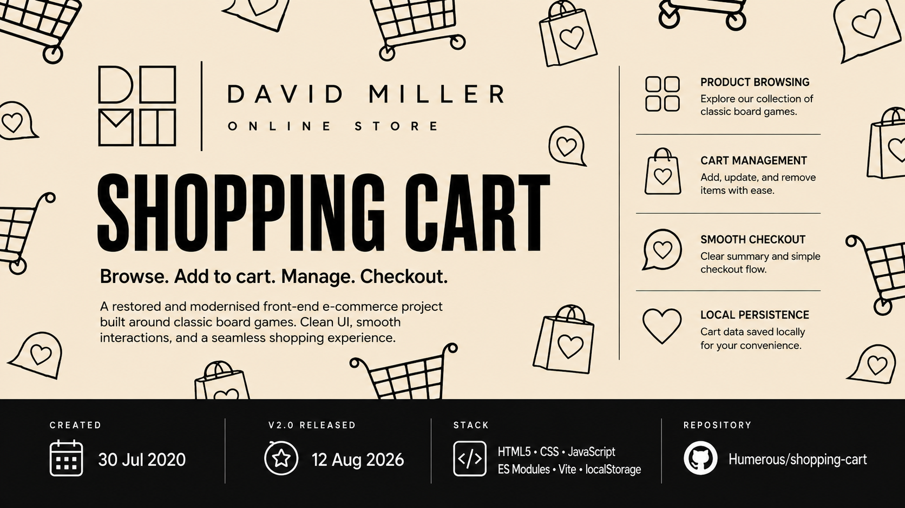

# Shopping Cart

**Restored front-end storefront demonstrating cart state, responsive UI and browser persistence.**

[](https://shopping-cart-two.vercel.app/)

A modernised e-commerce portfolio project built around a collection of classic board games.

**Live:** [shopping-cart-two.vercel.app](https://shopping-cart-two.vercel.app/)  
**Stack:** HTML5 · CSS · JavaScript ES Modules · Vite · localStorage  
**Status:** v2 · Complete / Live

## Project History

### Original Build — 2022

This project started as an early front-end development project while I was learning HTML, CSS and JavaScript.

The original version explored:

- Product listings
- Shopping-cart behaviour
- Quantity controls
- Browser storage
- Delivery calculations
- VAT calculations
- Basic e-commerce interaction

### Modernised — 2026

The original concept was kept, but the project was rebuilt and brought up to current standards.

The modern version includes:

- Responsive layouts
- Modern CSS
- Semantic HTML
- Improved accessibility
- Updated product imagery
- Persistent cart state with `localStorage`
- Quantity and removal controls
- Delivery and VAT calculations
- Contact-form validation
- Mobile navigation
- Production build with Vite

## Technology

- HTML5
- CSS
- JavaScript ES Modules
- Vite
- localStorage

## Product Catalogue

The store currently includes ten classic games:

- Monopoly
- Chess
- Scrabble
- Battleship
- Trivial Pursuit
- Draughts
- Connect Four
- Cluedo
- Snakes and Ladders
- Risk

## Run Locally

Install dependencies:

```bash
npm install
```

Start the development server:

```bash
npm run dev
```

Create the production build:

```bash
npm run build
```

Preview the production build:

```bash
npm run preview
```

## Project Versions

**Original / Legacy Version — v1.0**  
2022 learning project preserved through repository history.

**Modernised Version — v2.0**  
Restored, modernised and deployed in 2026.

## Project Status

**v2.0 — Complete / Deployed**

This project forms part of my developer portfolio and shows the progression from an earlier learning project to a modernised, production-ready implementation.

## Source

GitHub: `Humerous/shopping-cart`

---

Board-game names and trademarks remain the property of their respective owners. This is an independent portfolio project and is not affiliated with or endorsed by those brands.
